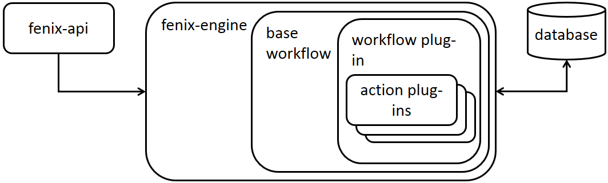
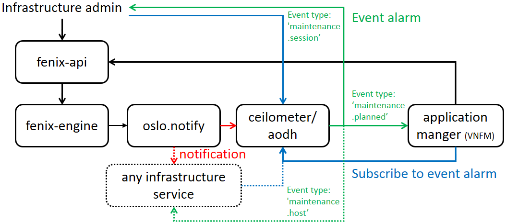

.. _architecture:

==================
Fenix Architecture
==================

Fenix is an engine designed to make a rolling infrastructure maintenance and
upgrade possible with zero downtime for the application running on top of it.
Interfaces are designed to be generic, so they can work with different clouds,
virtual machines and containers. The first use case is with OpenStack and VMs,
but the aim is to have a wider scope, like edge (Akraino) and Airship.

The key in Fenix providing the zero downtime is to have an ability to
communicate with an application manager (VNFM). As the application is aware of
maintenance affecting its instances, it can safely be running somewhere else
when it happens. The application also get to know about new capabilities coming
over infrastructure maintenance/upgrade and can plan its own upgrade at the
same. As Fenix also provides scaling request towards applications, it is
possible to make upgrades without adding more resources.

Fenix has the ability to tell any infrastructure service when a host is down
for maintenance or back in use. This is handy for different things, like
enabling/disabling self-healing or billing. The same interface could also be
used for adding/removing hosts.

The design makes it possible to make everything with 'one-click'. Generic API,
notifications and tracking in a database are provided by Fenix together with
example workflow and action plug-ins. Anyhow, to build for specific cloud
deployment, one can provide workflow and action plug-ins to Fenix to fit to
any use case one can think of.

Internal design
===============

Fenix desing is pluggable:

**fenix-api** is used to make maintenance workflow sessions and to provide admin
and project owners an API to communicate to Fenix.

**fenix-engine** is running the maintenance workflow sessions and keeping track
in database.

**base workflow** is providing basic Fenix functionality that can be inherited
by the workflow plug-in used in each maintenance session.

**workflow plug-in** is the workflow for your maintenance session. Different
plug-ins can be implemented for different clouds and deployments.

**action plug-ins** are called by the workflow plug-in. It is possible to have
different type of plug-ins, and if there is more than one of a specific type,
one can also define the order they are executed:

* **pre** plug-in is run first
* **host** plug-in is run for each host
* **post** plug-in is run last

There is a possibility to define 'metadata' to further indicate plug-in
specifics.

Interface design
================

Fenix has API and notifications that can be caught by different endpoint
interfaces by subscribing to corresponding event alarm:

Infrastructure admin has an API to trigger, query, update and delete
maintenance sessions. Admin can also receive the status of a maintenance
session by the 'maintenance.session' notification trough 'oslo.notification'.
It is also possible to get the same information by subscribing to the
corresponding event alarm. This is handy for getting the event to own favorite
API endpoint.

Project/application having instances on top of the infrastructure under
maintenance can have a manager (VNFM) to communicate with the maintenance
session workflow. The manager can subscribe to project specific
'maintenance.planned' event alarms to get information about maintenance session
state affecting its instances. The subscription also tells to the workflow that
the project have a manager capable of communicating with the workflow.
Otherwise, workflow should have a default behavior towards project instances,
or fail if communication is mandatory in your cloud use case. There is also
a project-specific API to query its instances under current maintenance
workflow session state and to answer back to workflow.

Any infrastructure service can also be made to support 'maintenance.host'
notification. This notification is telling wether a host is in maintenance or
back in normal use. This might be important for enabling/disabling self-healing
or billing. Notification can also be used to indicate when a host is added or
removed.

